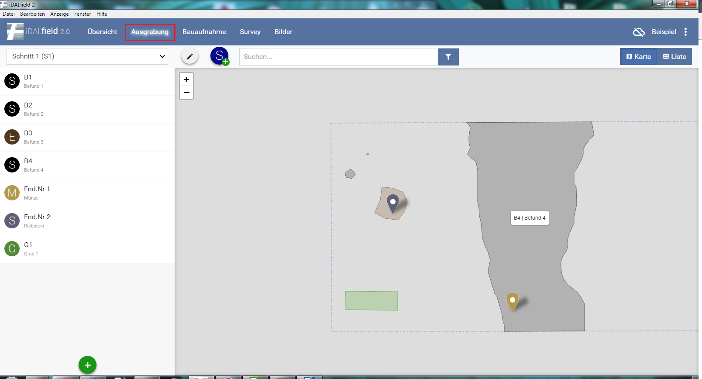
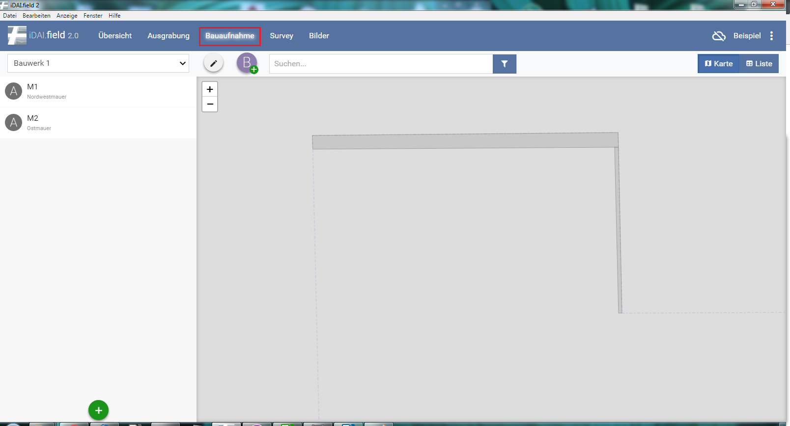
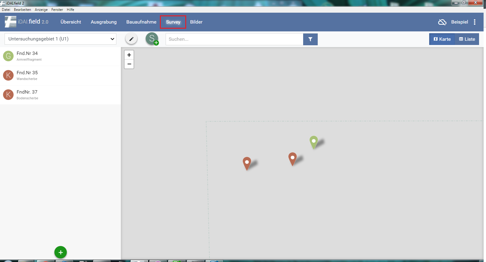
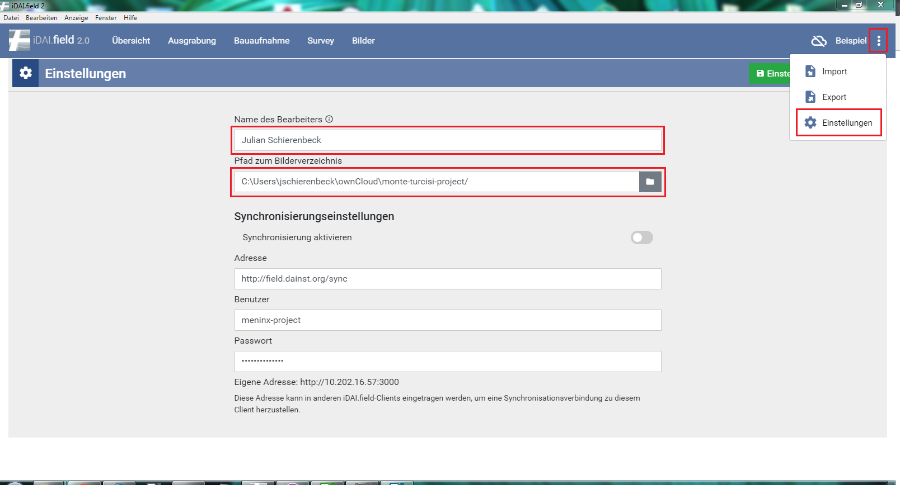

## 2. Der Client und seine Ansichten

*Abb. 2: Der Übersichtsbildschirm*

Startseite des Clients. In diesem Bereich werden die verschiedenen Menü-Ebenen beschrieben. Rechts oben wird angezeigt, ob der Client zu einem anderen oder zum Server synchronisiert 
sowie der Projektname (Beispiel).\
*(siehe: Abschnitt 7 Das Projekt, Abschnitt 5 Synchronisation mit anderen Client(s))*

### 2.1 Übersicht

Der Übersichts-Bildschirm: Hier können Ressourcen
angelegt werden und das gesamte Projekt überblicksartig betrachtet
werden. Das Anlegen von Ressourcen geschieht über den  Button. Hier
können nur Haupttypen angelegt werden. Schnitte, Bauaufnahmen, Survey
Areale und Orte.\
*(siehe: Abschnitt 8 Anlegen von Ressourcen)*

### 2.2 Ausgrabung

Der Ausgrabungs-Bildschirm: Hier können alle Ressourcen
innerhalb von Schnitten eingesehen und bearbeitet werden. Die Zuordnung
zum Schnitt wird automatisch vorgenommen, weitere Ressourcen werden
immer innerhalb eines Schnittes angelegt.
Jede Ressource kann ausgewählt werden, auf der rechten Seite wird eine
Übersicht der eingetragenen Felder und deren Attribute angezeigt. Das
Anlegen von Ressourcen geschieht über den  Button. Zudem können
weitere Schnitte hinzugefügt  und bearbeitet werden .\
*(siehe: Abschnitt 8 Anlegen von Ressourcen)*

*Abb 3: Der Ausgrabungs-Bildschirm*

### 2.3 Bauaufnahme

*Abb 4: Der Bauaufnahme-Bildschirm*

Der Bauaufnahme-Bildschirm: Hier können alle Ressourcen innerhalb von
Bauaufnahmen eingesehen und bearbeitet werden. Die Zuordnung zur
Bauaufnahme wird automatisch vorgenommen, weitere Ressourcen werden
immer innerhalb einer Bauaufnahme angelegt.
Jede Ressource kann ausgewählt werden, auf der rechten Seite wird eine
Übersicht der eingetragenen Felder und deren Attribute angezeigt. Das
Anlegen von Ressourcen geschieht über den ![Plusbutton]../buttons/Plusbutton.png) Button. Zudem können
weitere Bauaufnahmen hinzugefügt  und bearbeitet werden
.\
*(siehe: Abschnitt 8 Anlegen von Ressourcen)*

### 2.4 Survey

*Abb 5: Der Survey-Bildschirm*

Der Survey-Bildschirm: Hier können alle Ressourcen innerhalb eines
Survey-Areals eingesehen und bearbeitet werden. Die Zuordnung zum
Survey-Areal wird automatisch vorgenommen, weitere Ressourcen werden
immer innerhalb eines Survey-Areals angelegt.\
Jede Ressource kann ausgewählt werden, auf der rechten Seite wird eine
Übersicht der eingetragenen Felder und deren Attribute angezeigt. Das
Anlegen von Ressourcen geschieht über den  Button. Zudem können
weitere Survey-Areale hinzugefügt  und bearbeitet werden
.\
*(siehe: Abschnitt 8 Anlegen von Ressourcen)*

### 2.5 Einstellungen

Im Einstellungs-Fenster wird der/die aktuelle BenutzerIn, also
BearbeiterIn eingetragen. Diese Information wird automatisch in die
Datensätze geschrieben. Das Feld sollte nicht leer bleiben.\
*(siehe: Abschnitt 5 Synchronisation mit anderen Clien(s))*

*Abb. 6: Einstellungsfenster*
