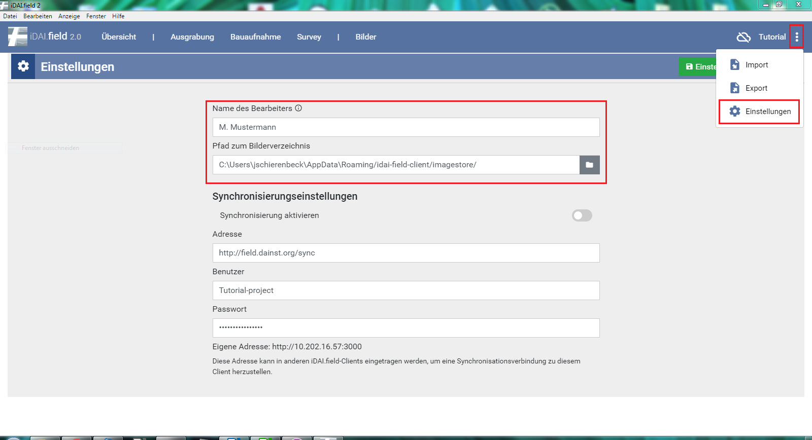

## 3. Einstellungen

Im Einstellungs-Fenster wird der/die aktuelle BenutzerIn, also
BearbeiterIn eingetragen.\
Diese Information wird automatisch in die
Datensätze geschrieben. Das Feld sollte nicht leer bleiben.\
*(siehe: Abschnitt 7 Synchronisation mit anderen Clien(s))*

*Abb. 3: Einstellungsfenster*