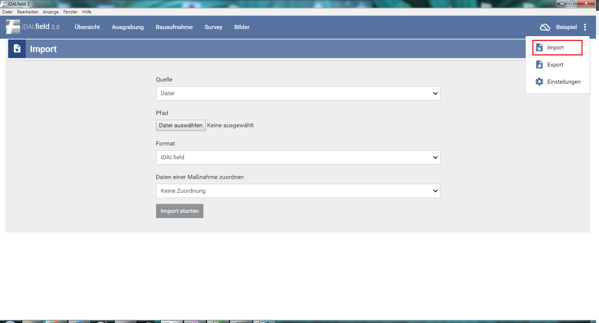
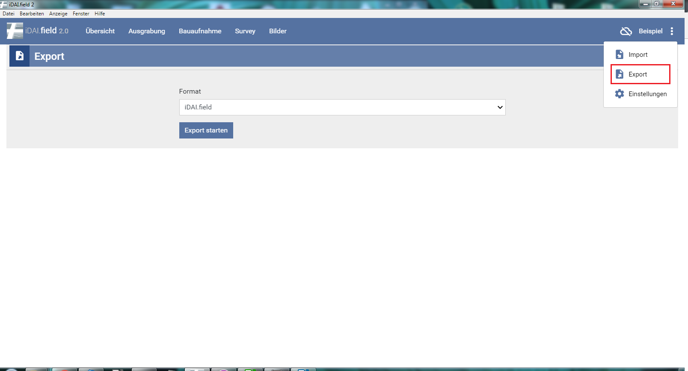

## 4.1 Import

Der Import lässt verschiedene Dateitypen zu (Quelle: Datei). Der Pfad
für die betreffende Datei muss ausgewählt werden. Im Falle eines Imports
aus einer iDAI.field-Datei (jsonl) kann der Import ohne weitere
vorherige Maßnahmen durchgeführt werden. Soll eine GEOjson importiert
werden, ist ein Feld „identifier“ in der Datei **notwendig.** Zudem muss
die Ressource bereits im Client existieren, mit identischem Bezeichner.
Anschließend erfolgt eine Meldung, wie viele Ressourcen importiert
wurden. Existiert die Bezeichnung des Feldes „identifier „ als
Ressource, wird diese automatisch den eingeladenen Zeichnungen
zugeordnet.

*Abb 10: Importfenster*

## 4.2 Export

Hier kann das gesamte Projekt exportiert werden. Die Dateiendung ist
.jsonl. Diese kann bequem in den Client importiert werden, auch ohne das
vorherige Anlegen von Ressourcen.

*Abb. 11: Exportfenster*