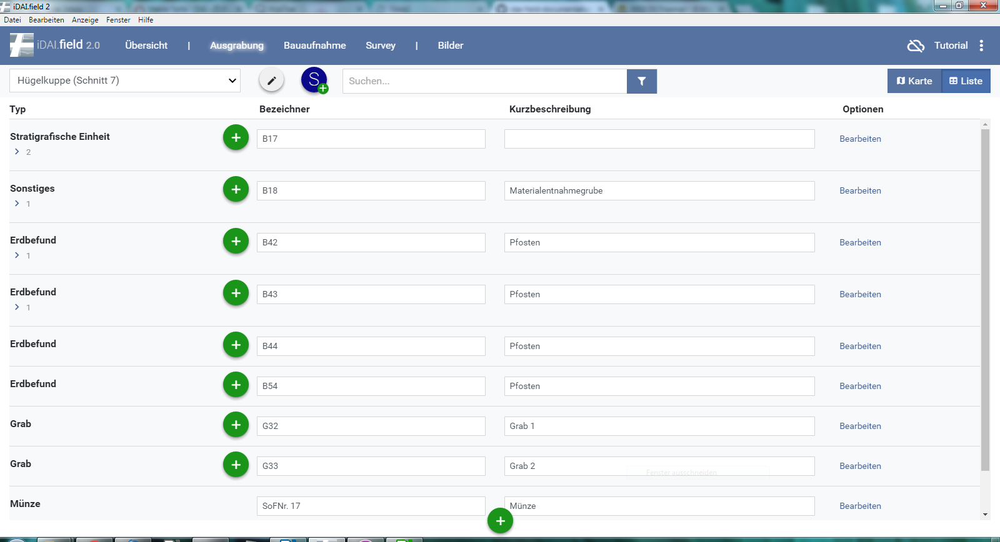

## 8. Grundlegende Funktionen

### 8.1 Karten- und Listenansicht

In der oberen, rechten Ecke kann zwischen einer Karten- und einer
Listenansicht unterschieden werden. Die Kartenansicht (Standard) zeigt
hier die eingegebenen oder importierten Strukturen der Ressourcen und
alle eingelesenen Karten an.

In der Listenansicht erhält der Nutzer eine tabellarische Ansicht aller
angelegten Ressourcen\
Die erste Übersicht enthält hierbei eine kleine Auswahl an Informationen
wie die Bezeichnung und die Kurzbeschreibung.

*Abb 24: Listenansicht*

Werden unter den Ressourcen weitere, untergliederte Ressourcen angelegt, werden diese in der Listenansicht
unter der oberliegenden Ressource angezeigt. Standartmäßig sind diese eingklappt und durch einen grauen Pfeil
markiert. Durch einfaches Klicken auf diesen werden diese Ressourcen angezeigt (Abb. 25).

\
*Abb 25: Untergeordnete Ressourcen, Listenansicht*

### 8.2 Suchen

In der Suchleiste ist es möglich, nach Namen von Ressourcen oder nach
Teilbegriffen zu suchen.\
Bei Eingabe reduziert sich die Anzahl der angelegten Ressourcen bis das
gesuchte übrig bleibt.\
Bei der Anwendung der Filter werden alle Ressourcen aus dem ausgewählten
Filter angezeigt.

\
*Abb 26: Suchfeld*
