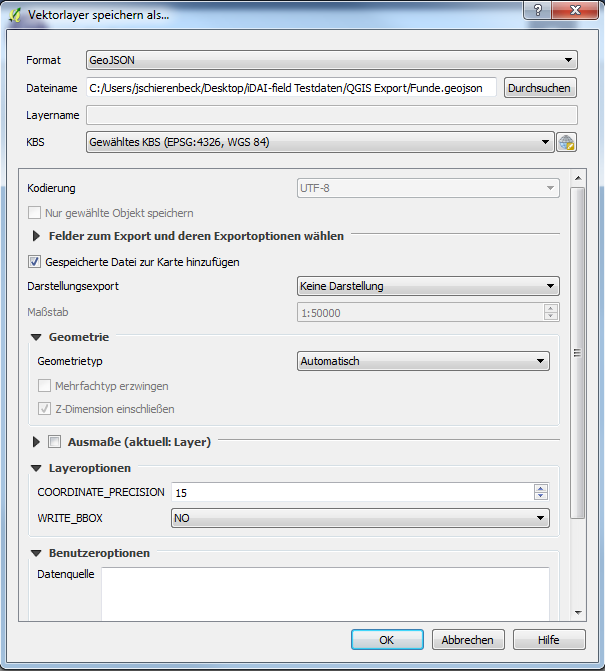

## 2. Weitere Arbeiten in QGIS

Zur weiteren Bearbeitung werden die Messergebnisse in QGIS geöffnet.
Hier werden die Ergebnisse zunächst begutachtet und mit einem wichtigen, neuen Datensatz versehen, der für die Automatische Zuordnung innerhalb der Datenbank unerlässlich ist. Zum Abschluss werden die Layer als GeoJSON abgespeichert.
Dieses Format wird für das Einladen in die Datenbank benötigt.

-Öffnen Sie QGIS.
-Laden Sie die shp. Dateien aus Ihrem Ausgabeordner in Ihre QGIS Datei.\
-Wählen Sie ein KBS aus. Für die Testdaten EPSG: 4326, WGS 84.\
-Wiederholen Sie den Vorgang für alle in Survey 2 GIS vorbereiteten Dateien.\
-Klicken Sie mit rechter Maustaste auf den ersten Layer und wählen Sie „Attributtabelle öffnen“.\
-Aktivieren Sie den Bearbeitungsmodus und fügen Sie eine neue Spalte hinzu. Tastenkürzel: Strg + W. (Abb. 1).\
-Benennen Sie diese Spalte mit der Bezeichnung „identifier“, wählen Sie als Typ „Text (string)“ und setzen Sie die Länge auf 20.\
-Geben Sie die entsprechende Befundnummer oder die Fundnummer als Ganzzahl in die Zeile ein. Bspl. Bei Befund 10, 10.\
-Beenden Sie den Bearbeitungsmodus und klicken Sie auf Speichern.\
-Bereiten Sie einen Speicherort für die GeoJSON Dateien vor.\
-Klicken Sie mit rechter Maustaste auf den ersten Befundlayer und wählen Sie „Speichern als...“\
-Wählen Sie als Format GeoJSON, geben Sie den Speicherort und einen Dateinamen an. (Abb. 3).\
-Klicken Sie auf OK.\
-Wiederholen Sie den Vorgang für alle Layer.

Die hieraus entstandenen GeoJSON Dateien der Befunde und Funde lassen sich einfach in die Datenbank iDAI-Field 2.0 einfügen nachdem hier die Ressourcen angelegt wurden.
Ist dies geschehen werden die Strukturen und Funde automatisch der jeweiligen Ressource zugeordnet.
Für weitere Informationen schauen Sie bitte unter *(siehe: [Einfügen von Messplänen aus GIS](../../manual/14._gis)).*

\
*Abb 1: Hinzufügen der identifier Spalte*

\
*Abb 2: Attributtabelle mit identifier Spalte*

\
*Abb 3: Speichern als GeoJSON*

