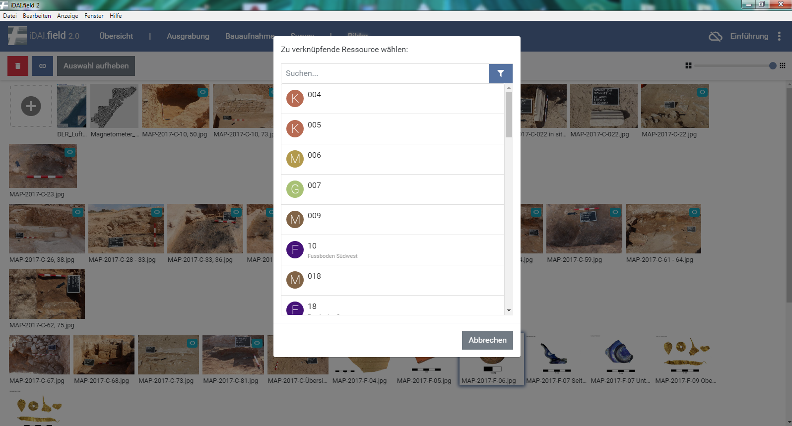
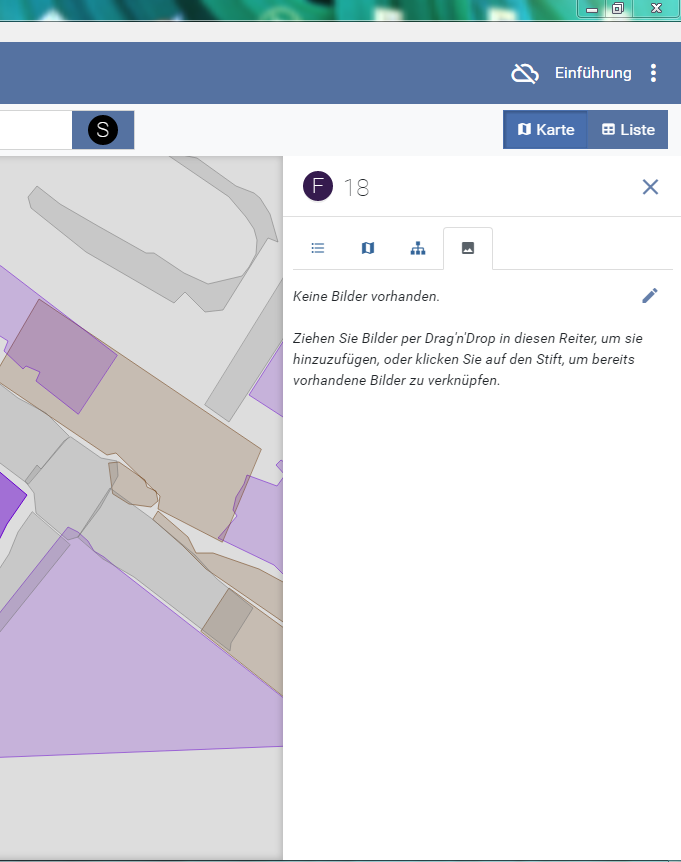

## 4. Einladen von Bildern

Im Testdatenpacket sind auch Bilder verfügbar.\
Gehen Sie in der Datenbank auf den Reiter „Bilder“ und ziehen Sie die Bilder aus dem Testdatenordner (Abb. 9) auf das Plusfeld.\
Wählen Sie für die Bilder die Kategorie Foto aus. Für das Verknüpfen wählen Sie die entsprechenden Abbildungen aus und klicken Sie auf "Verknüpfen". (Abb. 11 und 12).\
Für eine weitere Möglichkeit wählen Sie mit einem doppelklick die entsprechende Ressource und verknüpfen über das rechte Informationsfeld die Abbildungen. (Abb. 13).\
Für weitere Informationen zum Einladen von Bildern schauen Sie bitte unter: *(siehe: [Bilder](../../manual/05._pictures)).*

\
*Abb 9: Bilder einfügen*

\
*Abb 10: Eingefügte Bilder*

\
*Abb 11: Verknüpfung der Bilder*

\
*Abb 12: Verknüpfen über Ressourcen*

\
*Abb 13: Auswahl der Abbildungsart*