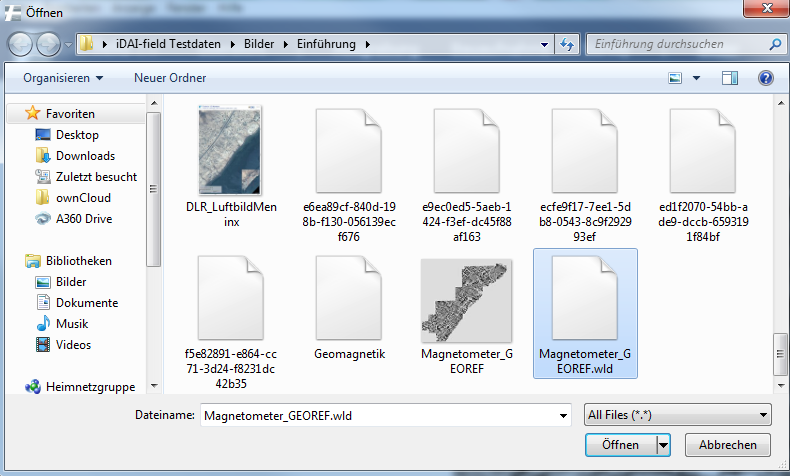

## 5. Das Hintergrundbild mit wld. Datei

Als Hintergrundbild ist in den Testdaten ein Magnetogramm vorgesehen.
Im Ordner ist eine dazugehörige wld. Datei abgelegt. Klicken Sie doppelt auf das Bild des Magnetogramms.
Gehen Sie in den Reiter „Georeferenzdaten“ auf der rechten Seite und fügen Sie die wld. Datei hinzu. (Abb. 14).\
Für weitere Informationen schauen Sie unter: *(siehe: [5.2 World Files und Georeferenzierung](../../manual/05._pictures)).*

\
*Abb 14: Hinzufügen einer wld. Datei*