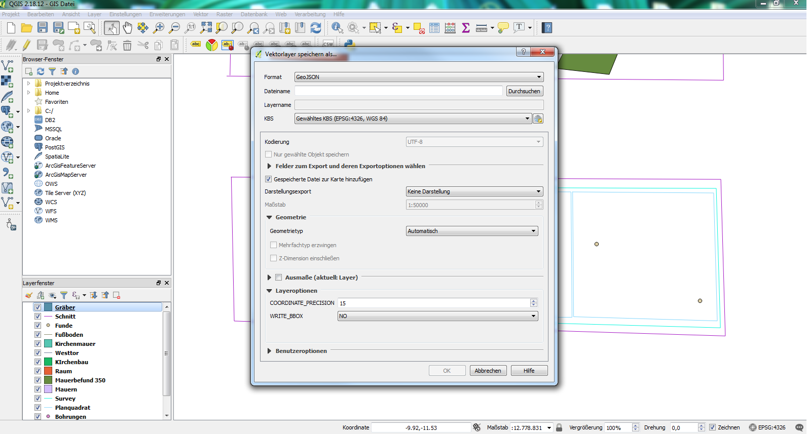

## 1. Einfügen von Messplänen aus GIS

Wie im *(Abschnitt 4.1 Import)* bereits beschrieben ist es möglich GEOjson Dateien
in die Datenbank einzuladen. Dies betrifft in der Regel Pläne und ist
die vorgesehen Methode um Messpläne aus einem GIS in die Datenbank zu
überführen. Hierfür muss ein „identifier“- Feld im Layer existieren und
dieses Muss als Ressource angelegt sein. Stimmt die Eingabe im
identifier-Feld mit der Ressource überein, so wird die Geometrie
automatisch zu dieser zugeordnet.\
Ein GEOjson kann im bspl. Im QGIS einfach erstellt werden in dem per
Rechtsklick auf den Layer „Speichern als“ und dann GEOjson ausgewählt
wird.

*Abb. 27: Speichern als GEOjson*

### 1.1 Importieren von Multigeometrien

Sollten Fälle auftreten, bei denen es notwendig ist mehrere Strukturen
einer Ressource mit einem identifier zuzuordnen, dann müssen diese
Geometrien als Multigeometrien ausgegeben werden. Diese können im
Anschluss als geoJSON in den Client importiert werden. Wird hingegen
eine Datei eingeladen, welche aus mehreren Geometrien besteht, welche
einfach denselben identifier besitzen, dann wird die vorherige Geometrie
überschrieben und die letzte, importierte Geometrie wird im Client
angezeigt.\
Für das Ausgeben von Multigeometrien gibt es in QGIS einen einfachen
Weg. Über den Reiter „Vektor“ und der Auswahl „Geometrie-Werkzeuge“
wählt man das Werkzeug: „Ein- zu Mehrteilig“ oder im englischen „single
part to multipart“.\
Hier muss zunächst der Eingabelayer, also der Layer welcher
zusammengelegt werden soll, ausgewählt werden. Zum zweiten wird das
Schlüsselfeld ausgewählt. Hier ist es notwendig das vorher angelegte
Feld des identifiers zu wählen, da dieses Feld übertragen wird und man
die Ausgabedatei direkt in den Client laden kann. Im letzten Feld wird
der Speicherort festgelegt und das Speichermedium geoJSON ausgewählt.
Mit Run wird der Prozess in Gang gesetzt. Das gespeicherte geoJSON kann
nun als Multigeometrie in den Client importiert werden.

*Abb. 28: Ein- zu Mehrteilig, QGIS*

### 1.2 Verwendung von Survey 2 GIS

Für die Umsetzung einer Messung in GIS kann das Programm Survey 2 GIS
verwendet werden. Dies setzt eingemessene Strukturen in GIS um, erstellt
Geometrien und trennt nach Layern.\
Für die Verwendung ist ein Parser notwendig, der gegebenenfalls an die
eigene Datenaufnahme angepasst werden muss.\
Eigene Daten werden im Feld „Eingabe“ in das Programm eingelesen. Im
Darunter liegenden reiter „Parser-Schema“ wird der Parser ausgewählt.
Weitere Einstellungsmöglichkeiten und Erklärungen sind ausführlich im
offiziellen Handbuch zu finden, welches zweisprachig jeder Survey 2 GIS
Version als PDF beiliegt.

*Abb. 29: Arbeitsoberfläche Survey 2 GIS*

### 1.3 Anwendung des Parsers

Ein Parser besteht aus zwei Bereichen. Der erste betrifft die allgemeine
Arbeitsweise des Parsers, der zweite besteht aus verschiedenen Blöcken.
Hierbei steht jeder Block für einen einzelnen Abschnitt im Messcode.\
Für dieses Beispiel wurde der Max Beispiel Parser verwendet.

**[Parser]**

name = survey2gis sample for mode "Max" **Name des Parsers.**

tagging_mode = max **Welcher Modus, max, min, end, oder none.**

tag_field = TAG **Benennung des Geometrie Feldes**

key_field = ID **Benennung des Schlüssel Feldes. Bezeichnet das Feld, in
dem sich die Kennummer der Geometrie befindet. Alle Messpunkte einer
zusammengehörenden Geometrie benötigen dieselbe Benennung.**

key_unique = Yes **Mit Angabe dieses Feldes wird festgelegt, dass alle
Messdateien mit demselben Schlüsselwert auch ein gemeinsamer
Attributsatz zugeordnet wird.**

tag_strict = No

no_data = -1

geom_tag_point = "." **Einzelne Punktmessungen mit dem Code .**

geom_tag_line = "$" **Linienmessungen mit dem Code $**

geom_tag_poly = "@" **Polylinien mit dem Code @**

coor_x = COORX

coor_y = COORY** Benennung der Koordinatenfelder**

coor_z = COORZ

comment_mark = # **# Markierter Text ist Kommentar und wird nicht mit
berechnet.**

*Im Anschluss folgen **[Field]** Felder bei denen jedes
einzelne für eine Zeile in der Spalte steht.*

**67 1_GR_W_0_@_0 X 3513037.664 Y 5279881.392 Z 399.563**

**Messcode**

**Für die 67:**

[Field]

name = IDX **Name des Field Feldes. Jedes dieser Felder bekommt einen
Namen. IDX steht hier für die Indexnummer. Eine durchgehende Messnummer
die jede Messung braucht. Daher auch im Infofeld die Nachricht von 0 bis
n.**

info = Field with measurement index [0..n] **Info.**

type = integer **Typ ist Ganzzahl.**

empty_allowed = No **Feld darf nicht leer sein.**

separator = space **Spaltentrenner ist Leerzeichen.**

merge_separators = Yes **Dürfen mehrere aufeinanderfolgende Trenner als
einer behandelt werden, also mehrere Leerzeichen wie eins.**

unique = Yes **Wenn ja, dann wird überprüft ob der Wert mehrfach vergeben
wurde.**

**Für die 1:**

[Field]

name = LEVEL **Name: Level als Angabe: Hier steht die Planumsnummer**

info = N/A **Info: Nicht angegeben**

type = Integer **Typ ist eine Ganzzahl**

empty_allowed = No **Feld darf nicht leer sein**

separator = _ **Trenner zum NÄCHSTEN Feld ist ein Unterstrich**

merge_separators = No **Mehrere Trenner sind hier nicht zulässig**

**Für das GR:**

[Field]

name = TYPE **Name: Hier steht der Typus der Linie oder des Fundes**

info = N/A **Info: Nicht angegeben**

type = Text **Typ ist ein Textfeld**

empty_allowed = No **Darf nicht leer sein**

separator = _ **Trenner zum NÄCHSTEN Feld ist ein Unterstrich**

merge_separators = No

change_case = upper **Gibt an, dass der Inhalt der Textfeldes in
Großbuchstaben umgewandelt und ausgeschrieben werden soll, wenn hier
nachfolgend durch @ markiert eine diesbezügliche Angabe gemacht wird.**

@AU = Gold **AU würde also als GOLD ausgeschrieben werden.**

@AG = Silver

@KE = Pottery

**Für das W:**

[Field]

name = AUX **Name: AUX. Weist auf ein Hilfsfeld hin**

info = N/A

type = Text

empty_allowed = No

separator = _

merge_separators = No

change_case = upper

@P = Control point **Feld ist angelegt, damit der Buchstabe P in CONTROL
POINT umgewandelt wird.**

**Für die erste 0:**

[Field]

name = FEAT **Name: FEAT steht für feature number. Befundnummer**

info = N/A

type = Integer

empty_allowed = No

separator = _

merge_separators = No

**Für das @ Zeichen:**

[Field]

name = TAG **Name TAG. Geometrie tag. Angabe um welche Art es sich
handelt. Wird im Hauptbereich des Parsers festgelegt. @ = Polylinie,
Punkt wäre ein Punkt usw.**

info = N/A

type = Text

empty_allowed = No

separator = _

merge_separators = No

skip = Yes **Skip Yes bedeutet, dass das Feld zwar berechnet, jedoch
nicht n der Ausgabedatei gespeichert wird. Es wird geskippt, da es nur
für die Berechnung wichtig ist.**

**Für die zweite 0:**

[Field]

name = ID **Name: Besonderes ID Feld, wird durch den Hauptbereich als
Schlüsselfeld festgelegt. Gibt an die wievielte Linie man zeichnen
lässt. Hier im bspl die 0. **D**ie Nächste Struktur wäre 1, die darauf 2
usw.**

info = N/A

type = Integer

empty_allowed = No

separator = space **Angabe, dass der Trenner wieder ein Leerzeichen
ist.**

merge_separators = YesA **ngegeben, dass die Menge der Leerzeichen egal
ist.**

unique = Yes **Hier wird wieder überprüft, ob der Wert mehrfach vergeben
wurde, da man ja jede Struktur nur einmal zeichnen lassen kann.**

**Für die nachfolgenden Spalten der X Koordinaten**

[Field]

name = XLABEL **Dieses Feld für das X vor den Koordinaten**

info = Useless field **welches nur mit X benannt ist.**

type = text

empty_allowed = No

separator = space

merge_separators = Yes

skip = Yes

**Für das Koordinatenfeld der X Koordinaten**

[Field]

name = COORX **Angabe aus dem Hauptbereich. Hier X Koordinaten**

info = Holds X coordinate

type = double

empty_allowed = No

separator = space

merge_separators = Yes

**Für die nachfolgenden Spalten der Y Koordinaten**

[Field]

name = YLABEL **Dieses Feld für das Y vor den Koordinaten**

info = Useless field **welches nur mit Y benannt ist.**

type = text

empty_allowed = No

separator = space

merge_separators = Yes

skip = Yes

**Für das Koordinatenfeld der Y Koordinaten**

[Field]

name = COORY **Angabe aus dem Hauptbereich. Hier X Koordinaten**

info = Holds Y coordinate

type = double

empty_allowed = Noseparator = spacemerge_separators = Yes

**Für das Feld der Z Koordinaten ebenfalls zwei Field Felder benötigt.
Mit den vorherigen beinahe baugleich, mit der Ausnahme, dass im letzten
Feld kein Seperator Feld, also kein Trennungsfeld, mehr vorhanden sein
darf.**

Natürlich muss man sich beim Verwenden von Survey2GIS nicht strikt an
diese Art des Parsers oder aber die damit verbundene Benennung von
Messungen halten.

Es ist natürlich möglich einen eigenen Vermessungscode zu verwenden und
dann den Parser anzupassen.

Wichtig ist, dass jeder einzelne Teilbereich einer Zeile mit einem
[Field] Feld belegt ist, sodass das Programm dieses berechnen kann.

Man geht von links nach rechts vor und schreibt für jeden Abschnitt der
Codezeile das entsprechende Feld.

Auch weitere, hier nicht genannte Befehle existieren und können im
Handbuch nachgesehen werden.

Wichtig: Die genannten Trennungszeichen müssen eingehalten werden,
ebenso wie deren Anzahl, wenn das Feld merge_seperators mit No
angegeben wurde.
